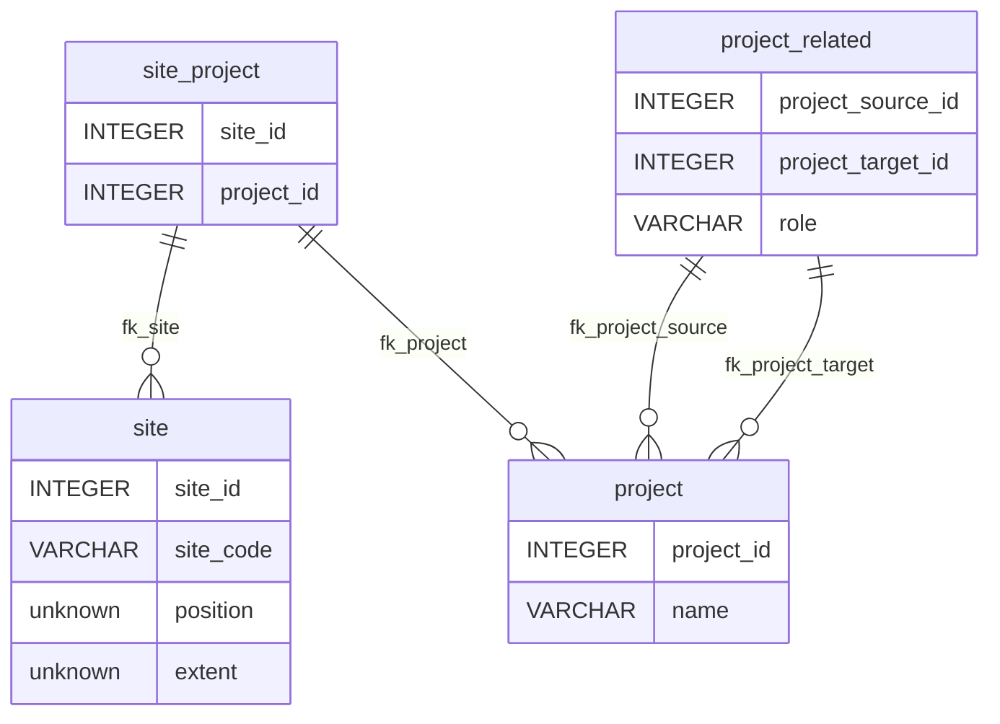

ISO-28258 Data Model
====================

Postgres data model implementing the ISO-28258 standard.

Concepts included
-----------------

- Project
- Site
- Plot
- Surface
- Profile
- Element
- Property
- Procedure
- Observation
- Result

Concepts not included
---------------------

- Horizon & Layer: as they are essentially the same in the domain, for now only ProfileElement is included.
- Sample
- Specimen

Open questions
--------------

- Is the Site concept necessary in this data model? (issue #1)

- Use Layer instead of ProfileElement? (issue #2)

- Should the data model also consider Samples and Specimens?

- Descritive observations do not have procedures. How relevant are they?

- Descriptive results allow for the same FoI to be associated to the same codelist more than once (issu #3) 

Diagrams
--------

