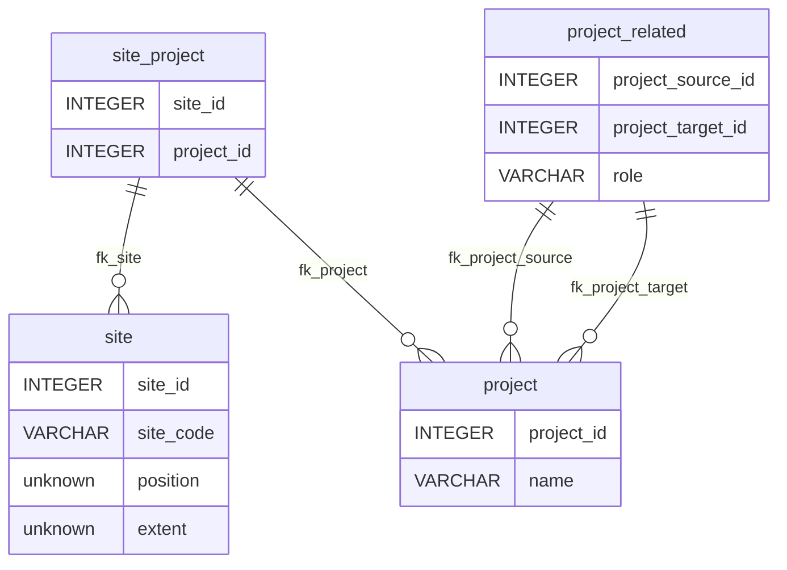
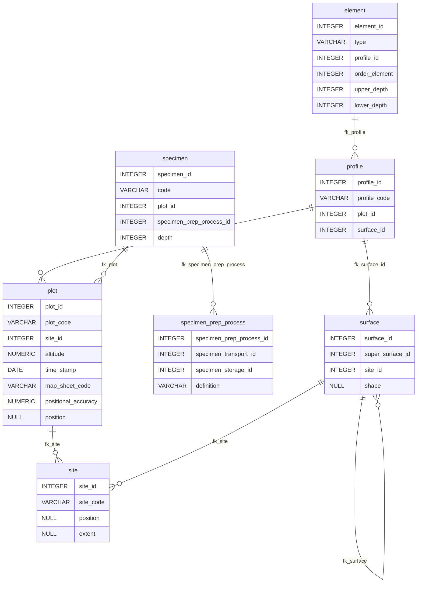
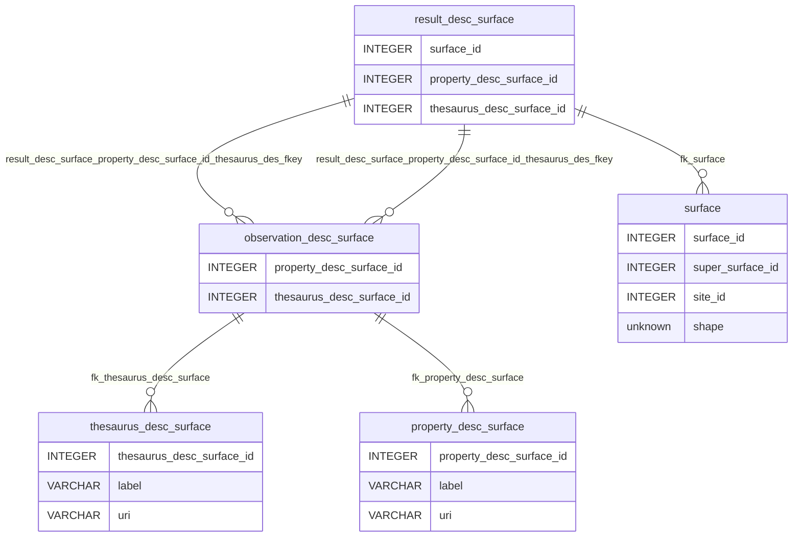
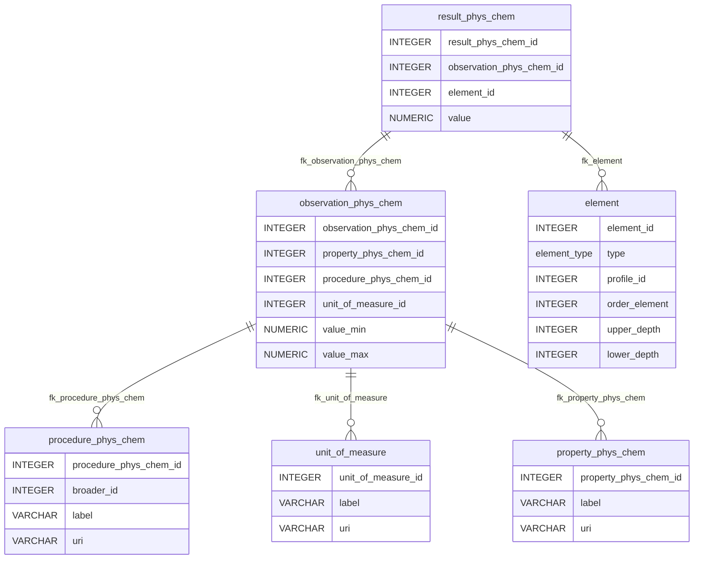
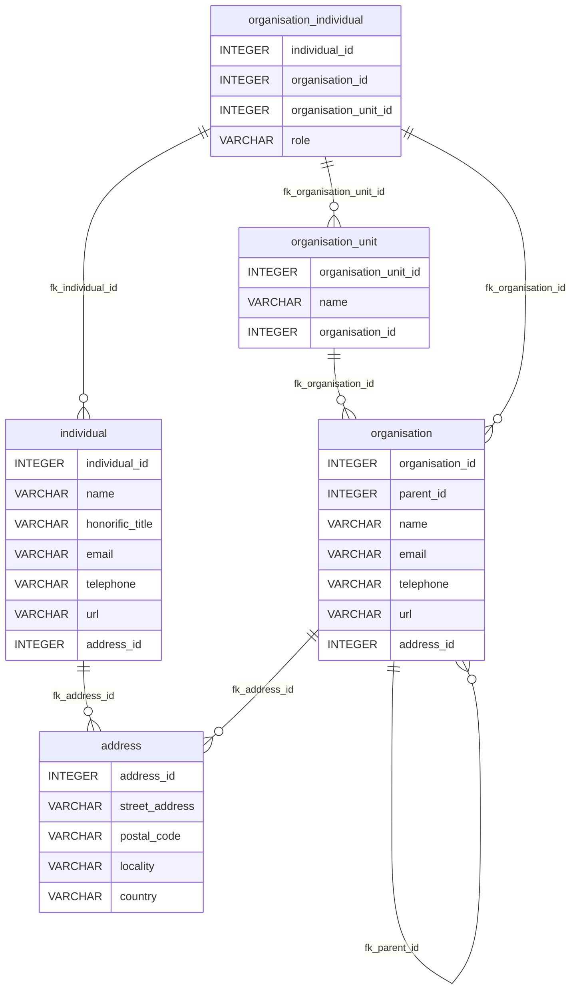

ISO-28258 Data Model
====================

Postgres data model implementing the ISO-28258 standard.

Copyright (C) 2022-2023  ISRIC - World Soil Information

This program is free software: you can redistribute it and/or modify
it under the terms of the GNU General Public License as published by
the Free Software Foundation, either version 3 of the License, or
(at your option) any later version.

This program is distributed in the hope that it will be useful,
but WITHOUT ANY WARRANTY; without even the implied warranty of
MERCHANTABILITY or FITNESS FOR A PARTICULAR PURPOSE.  See the
GNU General Public License for more details.

You should have received a copy of the GNU General Public License
along with this program.  If not, see <[https://www.gnu.org/licenses/](https://www.gnu.org/licenses/)>.

Recommended citation
--------------------

de Sousa, L. M., Calisto, L., van Genuchten P., Turdukulov, U., Kempen, B., 2023. Data model for the ISO 28258 domain model. ISRIC World Soil Information. Available at: [https://iso28258.isric.org/](https://iso28258.isric.org/)

Concepts included
-----------------

- Project
- Site
- Plot
- Surface
- Profile
- Element
- Specimen
- Property
- Procedure
- Observation
- Result

Concepts not included
---------------------

- Horizon & Layer: as they are essentially the same in the domain, for now only ProfileElement is included.
- Sample

Diagrams
--------

### Project and Site

### Features of Interest

### Descriptive Observations

A similar structure applies to the main FoIs: Surface, Plot, Profile, Element and Specimen. 

### Physio-chemical Observations

These observations only apply to Element. Surface, Plot and Profile have no physio-chemical observations for the time being. Specimen has its own structure, around the table `observation_numeric_specimen`, but it is empty, since its nature remains unknown. 

Meta-data model (VCard)
=======================

Concepts derived from the [VCard specification](https://www.w3.org/TR/vcard-rdf):
- Address
- Individual
- Organisation
- Organisation unit

***

***

How to deploy it
-----------------

We make use of graphile-migrate as a migration tool. In order to launch a new database:

### Using it the 1º time

1. Copy [.env.dist](.env.dist) into `.env`and make sure you edit the correct parameters according to your needs: `user` `password` `database name`
2. Make sure you have NodeJS installed on your system and run `corepack enable` from the terminal.
3. From inside the terminal, go to this repo root folder `yarn install`
4. After the previous step run `yarn run graphile-migrate reset --erase` 
5. You should now have a new database ready to go.
### Using it for development 

After running the previous batch you should have a new database ready to go. In a quick resume any SQL code can be done as:

1. Edit [migrations/current.sql](migrations/current.sql) and insert your code
2. Run `yarn run graphile-migrate watch` and once you are satisfied with your code commit it using `yarn run graphile-migrate commit --message "Your message"`
3. Check and test your implementation.

Please read carefully [migrations.md](migrations.md) in order to understand how the migration tool is configured.
