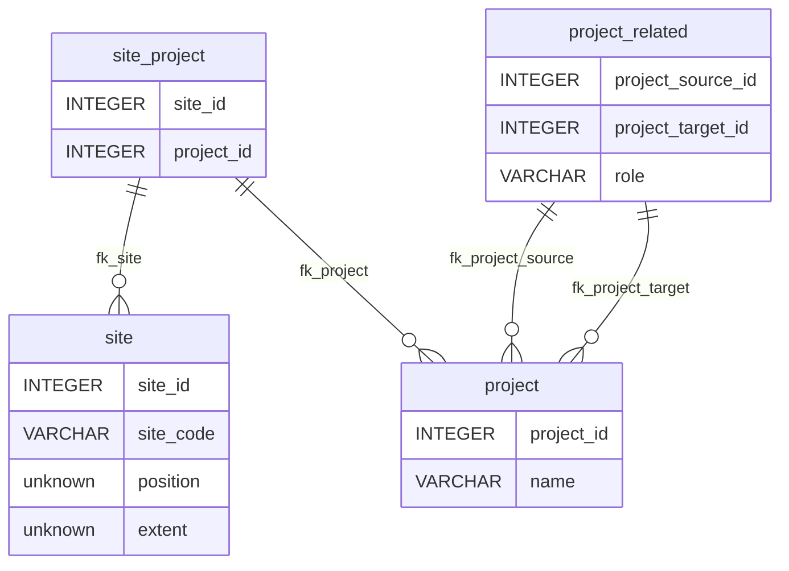
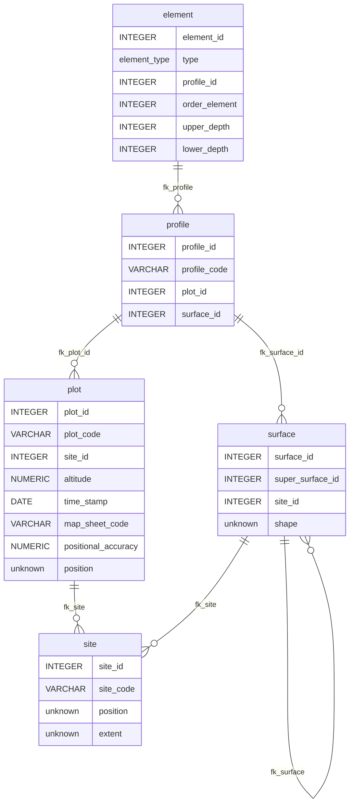
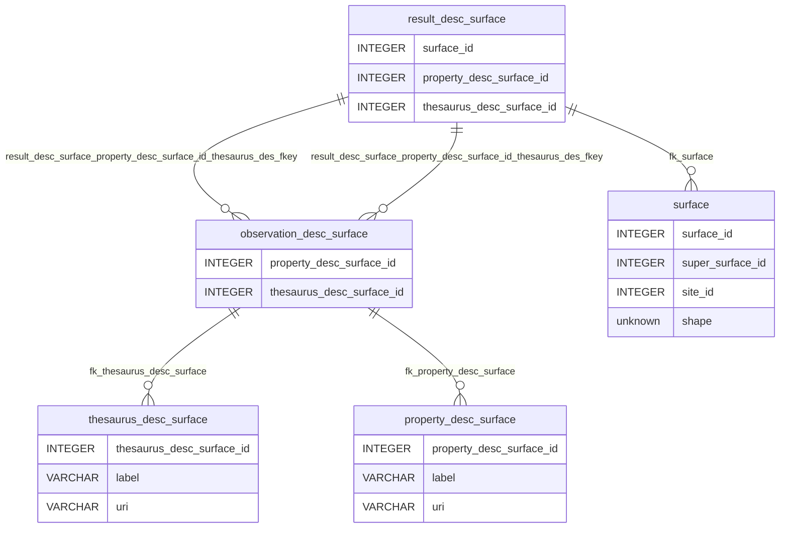
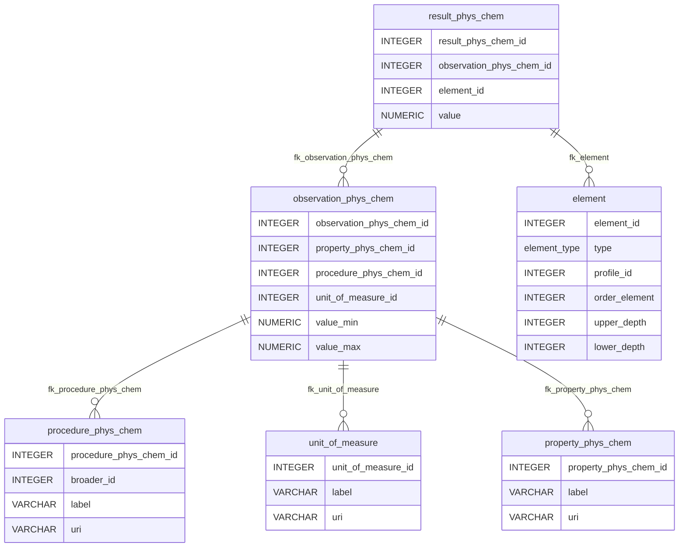

ISO-28258 Data Model
====================

Postgres data model implementing the ISO-28258 standard.

Concepts included
-----------------

- Project
- Site
- Plot
- Surface
- Profile
- Element
- Property
- Procedure
- Observation
- Result

Concepts not included
---------------------

- Horizon & Layer: as they are essentially the same in the domain, for now only ProfileElement is included.
- Sample
- Specimen

Open questions
--------------

- Is the Site concept necessary in this data model? (issue #1)

- Use Layer instead of ProfileElement? (issue #2)

- Should the data model also consider Samples and Specimens?

- Descritive observations do not have procedures. How relevant are they?

- Thesuarus for descriptive observations are not hierarchical, is it necessary? 

Diagrams
--------

### Project and Site

### Features of Interest

### Descriptive Observations

### Physio-chemical Observations

How to deploy it
-----------------

We make use of graphile-migrate as a migration tool. In order to launch a new database:

### Using it the 1º time

1. Copy [.env.dist](.env.dist) into `.env`and make sure you edit the correct parameters according to your needs: `user` `password` `database name`
2. Make sure you have NodeJS installed on your system and run `corepack enable` from the terminal.
3. From inside the terminal, go to this repo root folder `yarn install`
4. After the previous step run `yarn run graphile-migrate reset --erase` 
5. You should now have a new database ready to go.
### Using it for development 

After running the previous batch you should have a new database ready to go. In a quick resume any SQL code can be done as:

1. Edit [migrations/current.sql](migrations/current.sql) and insert your code
2. Run `yarn run graphile-migrate watch` and once you are satisfied with your code commit it using `yarn run graphile-migrate commit --message "Your message"`
3. Check and test your implementation.

Please read carefully [migrations.md](migrations.md) in order to understand how the migration tool is configured.